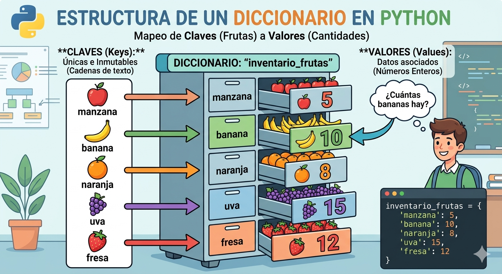

# Diccionarios_Python

conceptos y ejercicios de diccionarios en python.

- los diccionarios son datos estructurado es decir, hacen referencia a una coleccion de datos
-son una coleccion desordenada de pares de datos de la forma **clave:valor**, conocidos como elementos o items.
- son mutables, una vez definido se le pueden agregar nuevos elementos modificar o eliminar algunos de los que ya tiene
- tambien son conocidos como arreglos asociativos.
## Representacion grafica de un diccionario

## Sintaxis
`nombre_diccionario = {clave:valor1, clave:valor2,...}`

- cada item o elemento tiene la forma **clave:valor**
- en cada item hay una clave y uno o mas valores si se desconoce el valor se puede completar con *None*
- los elementos del diccionario se indexan por la clave
- las claves solo pueden ser datos inmutables
- los valores pueden ser datos mutables o inmutables
- las claves no pueden repetirse dentro de un diccionario
### Ejemplo

`frutas = {"manzana":34, "pera":45}`

## Operaciones

### Agregar elementos

`nombre_diccionario(clave) = valor`

`frutas["cereza"] = 90`

### Consultar o modificar elementos

`print("elvalor de pera es: ", frutas["pera])`

### Eliminar elementos

`del frutas["pera"]`

### Operador pertenencia
```py
if "cereza" in frutas:
    print("si esta cereza en el diccionario")
else
    print("no esta cereza en el diccionario")
```
## Ejercicio
Cree un programa en Python que utilice un diccionario para guardar los nombres de sus amigos y su telefono.  En este caso, el diccionario representa una agenda telefónica.  El programa pedirá nombres y telefonos y los irá guardando en el diccionario (los nombres en mayúscula).  Además, el programa debe permitir consultar o eliminar un telefono.  Incluya un menú de opciones.